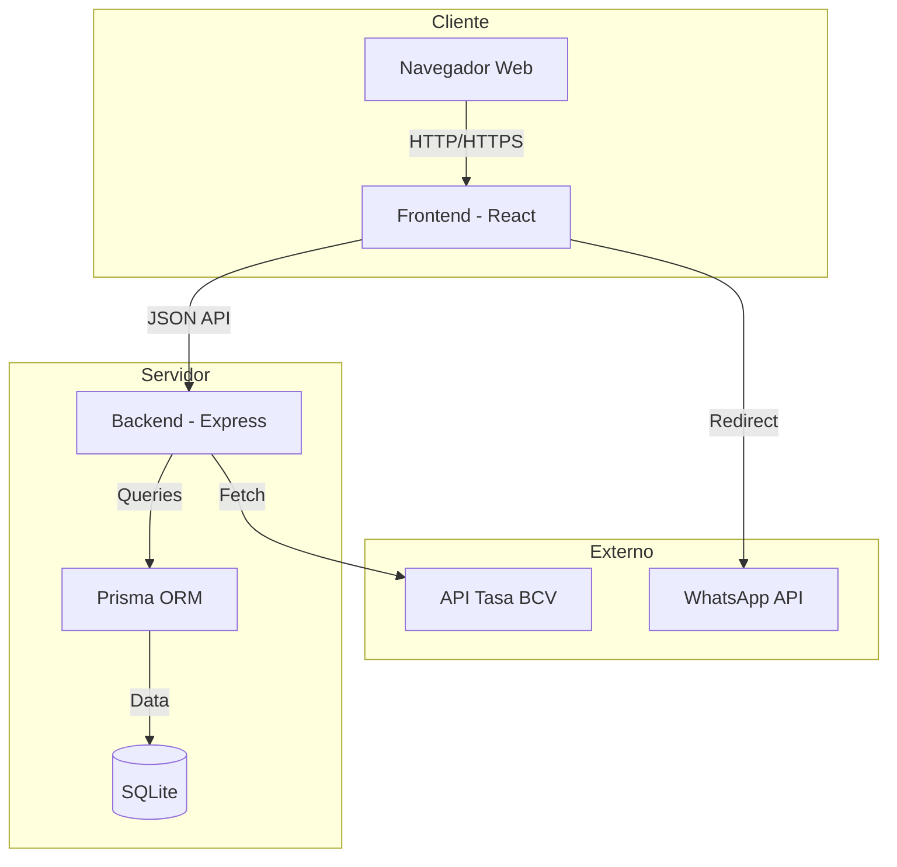
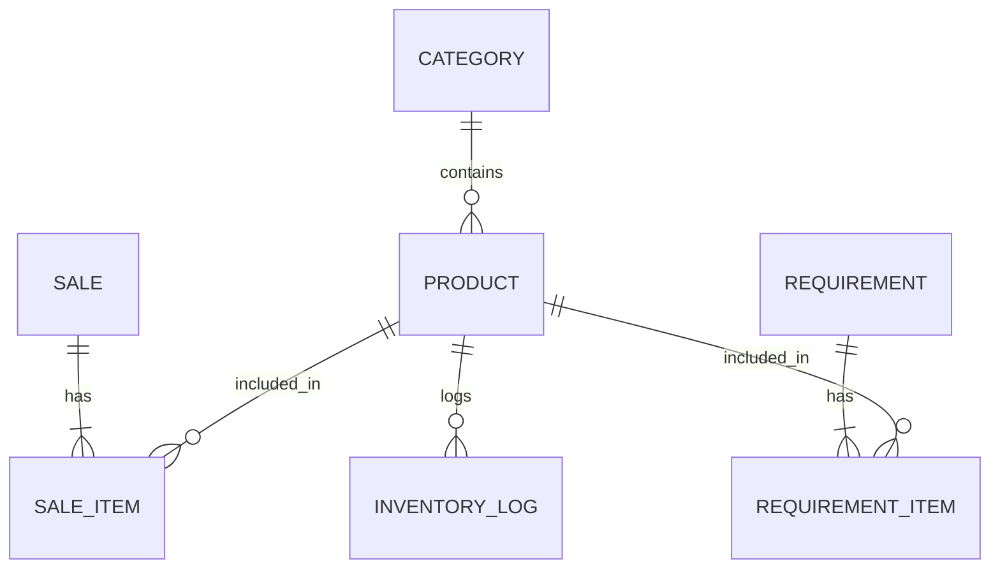

# 🏥 Análisis Funcional Detallado - Ana's Supplements E-commerce

Este documento proporciona una visión exhaustiva de todas las funcionalidades, reglas de negocio y especificaciones técnicas del sistema Ana's Supplements.

---

## 1. Introducción y Propósito
Ana's Supplements es una plataforma de e-commerce diseñada específicamente para farmacias, con un modelo de **venta asistida por WhatsApp**. Su propósito es permitir a los clientes explorar un catálogo dinámico, armar un carrito y enviar el pedido directamente a un vendedor, mientras proporciona al administrador herramientas robustas para la gestión de inventario, costos, ventas y reportes financieros.

---

## 2. Arquitectura del Sistema

### 2.1 Stack Tecnológico
- **Frontend**: React 18 (Vite), TypeScript, Tailwind CSS, shadcn/ui.
- **Backend**: Node.js, Express, TypeScript.
- **Base de Datos**: SQLite + Prisma ORM.
- **Autenticación**: JWT (JSON Web Tokens) + Google OAuth 2.0.
- **Validación**: Zod (Esquemas unificados para Frontend y Backend).
- **Comunicación**: REST API.
- **Integraciones**: WhatsApp (wa.me API), BCV (Tasa oficial), Google Identity Services.

### 2.2 Diagrama de Arquitectura

---

## 3. Modelo de Datos
El sistema utiliza una base de datos relacional con las siguientes entidades clave:

### 3.1 Entidades Principales
- **User**: Gestión de administradores y clientes. Incluye soporte para autenticación tradicional y federada (Google).
    - Campos nuevos: `googleId`, `username` (único y personalizado), `avatarUrl`.
- **Product**: Información detallada de medicamentos y productos.
- **Category**: Organización jerárquica del catálogo.
- **Sale**: Registro de transacciones realizadas.
- **Requirement**: Gestión de pedidos a proveedores (compras).
- **InventoryLog**: Auditoría completa de movimientos de stock.
- **BCVRate**: Historial y control de la tasa de cambio.

### 3.2 Diagrama Entidad-Relación

---

## 4. Módulos Funcionales

### 4.1 Módulo de Autenticación y Perfil (Nuevo)

#### 4.1.1 Flujo Google OAuth 2.0
- **Propósito**: Permitir un registro e inicio de sesión rápido y seguro.
- **Actores**: Cliente / Administrador.
- **Proceso**:
    1. El usuario inicia sesión con Google.
    2. Si es un usuario nuevo, se redirige a una **página intermedia de confirmación** (`/google-confirm`).
    3. El usuario personaliza su `username` (validado contra palabras ofensivas y disponibilidad).
    4. Se crea la cuenta vinculando el `googleId`.
- **Validaciones**: Nombre de usuario de 3-20 caracteres, alfanumérico + guiones bajos, filtro de lenguaje inapropiado.

#### 4.1.2 Sistema de Validaciones Robustas
- **Propósito**: Garantizar la integridad de los datos desde la entrada del usuario.
- **Características**:
    - **Validación en Tiempo Real**: Feedback visual inmediato con bordes rojos y mensajes descriptivos.
    - **Restricciones de Entrada**:
        - **Teléfono**: Solo dígitos numéricos (0-9).
        - **Nombres**: Solo letras y espacios (2-50 caracteres).
        - **Email**: Formato RFC 5322 estricto.
    - **Consistencia**: Mismos esquemas Zod aplicados en el cliente y el servidor.

---

### 4.2 Módulo Público (Cliente)

#### 4.2.1 Catálogo Dinámico
- **Propósito**: Permitir al cliente navegar y descubrir productos de la farmacia.
- **Actores**: Cliente final.
- **Entrada**: Filtros de categoría, términos de búsqueda, ordenamiento.
- **Salida**: Grilla de productos con imagen, nombre, precio (USD/BS) y disponibilidad.
- **Casos de Uso**:
    - Explorar medicamentos por categoría (e.g., "Antibióticos").
    - Ver detalles de un producto específico.
- **Excepciones**: Si no hay conexión con el servidor, se muestra un estado de error amigable.
- **Rendimiento**: Paginación y búsqueda optimizada en base de datos.
- **Criterios de Aceptación**: Precios siempre actualizados a la tasa BCV del día.

#### 4.2.2 Carrito y Checkout WhatsApp
- **Propósito**: Facilitar la compra asistida enviando el pedido al vendedor.
- **Actores**: Cliente final.
- **Entrada**: Selección de productos, datos de contacto (nombre, teléfono, dirección).
- **Salida**: Mensaje estructurado enviado a través de la API de WhatsApp.
- **Casos de Uso**:
    - Agregar productos al carrito desde el catálogo.
    - Revisar el subtotal en USD y BS.
    - Completar datos de envío y generar el pedido.
- **Excepciones**: Carrito vacío no permite avanzar al checkout.
- **Rendimiento**: Generación instantánea del mensaje de WhatsApp.
- **Criterios de Aceptación**: El mensaje debe incluir el detalle de cada producto y el monto total exacto.

---

### 4.3 Módulo Administrativo (Admin)

#### 4.3.1 Panel de Control (Dashboard)
- **Propósito**: Ofrecer una vista 360° del estado del negocio.
- **Actores**: Administrador.
- **Entrada**: Datos históricos de ventas, inventario y requerimientos.
- **Salida**: Gráficos y métricas (Ingresos, Ganancias, Stock Bajo, Pedidos Pendientes).
- **Casos de Uso**:
    - Monitorear ventas del día.
    - Identificar productos próximos a agotarse.
- **Rendimiento**: Consultas agregadas rápidas mediante `Promise.all`.
- **Criterios de Aceptación**: Las métricas deben reflejar datos en tiempo real.

#### 4.3.2 Gestión de Inventario
- **Propósito**: Controlar el ciclo de vida de los productos y sus costos.
- **Actores**: Administrador.
- **Entrada**: Datos del producto, costo de compra, gastos de envío, margen de utilidad.
- **Salida**: Ficha técnica del producto actualizada, log de movimientos.
- **Casos de Uso**:
    - Crear nuevo producto con cálculo automático de precio.
    - Ajustar stock manualmente por vencimiento o pérdida.
- **Excepciones**: El SKU no puede estar duplicado.
- **Criterios de Aceptación**: Cada cambio de stock debe quedar registrado en el `InventoryLog`.

#### 4.3.3 Gestión de Ventas (Backoffice)
- **Propósito**: Registrar las ventas concretadas (usualmente vía WhatsApp).
- **Actores**: Administrador.
- **Entrada**: Selección de cliente, lista de productos vendidos, método de pago.
- **Salida**: Recibo digital, actualización de stock, registro contable.
- **Casos de Uso**:
    - Registrar una venta cerrada por WhatsApp.
    - Consultar historial de ventas de un cliente.
- **Excepciones**: No se puede registrar una venta si no hay stock suficiente.
- **Criterios de Aceptación**: El total de la venta debe capturar la tasa BCV del momento.

#### 4.3.4 Requerimientos (Compras)
- **Propósito**: Gestionar el abastecimiento de mercancía con proveedores.
- **Actores**: Administrador.
- **Entrada**: Lista de productos a pedir, proveedor, costos unitarios pactados.
- **Salida**: Orden de requerimiento en estado `PENDING`, `ORDERED` o `RECEIVED`.
- **Casos de Uso**:
    - Crear pedido de reposición.
    - Marcar pedido como recibido para incrementar stock automáticamente.
- **Criterios de Aceptación**: El stock solo se incrementa cuando el estado cambia a `RECEIVED`.

---

## 5. Flujos de Trabajo Críticos

### 5.1 Ciclo de Venta y Despacho
1. **Captación**: El cliente arma su pedido en la web.
2. **Conversión**: El cliente envía el pedido por WhatsApp; el vendedor confirma disponibilidad y pago.
3. **Registro**: El Admin registra la venta en el sistema seleccionando los productos.
4. **Actualización**: El sistema descuenta el stock y genera el log de inventario.

### 5.2 Ciclo de Costeo y Rentabilidad
1. **Compra**: Se registra un requerimiento con los costos de factura.
2. **Recepción**: Al recibir, se actualiza el costo promedio/último costo del producto.
3. **Precio**: El sistema sugiere el PVP basado en el margen configurado.
4. **Análisis**: El reporte de rentabilidad compara el costo (USD) vs venta (USD) para calcular el margen neto real.

---

## 6. Especificaciones Técnicas y APIs

### 6.1 APIs Expuestas (Backend)
- **Auth**: `POST /api/auth/login`, `POST /api/auth/refresh`.
- **Público**:
    - `GET /api/products`: Catálogo con filtros.
    - `GET /api/categories`: Lista de categorías activas.
- **Admin**:
    - `POST /api/admin/sales`: Registro de nueva venta.
    - `GET /api/admin/reports/dashboard`: Métricas generales.
    - `PUT /api/admin/products/:id`: Actualización de inventario.

### 6.2 Integraciones Externas
- **WhatsApp**: Uso de enlaces `wa.me` con plantillas de texto dinámicas.
- **Tasa BCV**: Integración (manual o vía scraping/API) para mantener el Bolívar actualizado frente al Dólar.

---

## 7. Calidad, Seguridad y Auditoría

### 7.1 Manejo de Errores y Excepciones
- **Validación**: Uso de `Zod` o validaciones de esquema en Express para prevenir datos corruptos.
- **Logs de Error**: Captura centralizada de excepciones para depuración.

### 7.2 Auditoría de Inventario
- El modelo `InventoryLog` es el corazón de la confianza del sistema.
- Ningún proceso puede alterar el `stock` en la tabla `Product` sin dejar un rastro en `InventoryLog`.

### 7.3 Seguridad de Datos
- **JWT**: Tokens de corta duración con rotación mediante Refresh Tokens.
- **CORS**: Restricción de acceso solo desde el dominio del frontend.
- **Helmet**: Implementación de cabeceras de seguridad para mitigar ataques XSS y Clickjacking.

---

## 8. Criterios de Aceptación y Calidad
1. **Precisión Financiera**: Los cálculos de ganancias deben coincidir con los registros de costos.
2. **Integridad de Inventario**: El stock nunca debe ser negativo (validaciones en backend).
3. **Rendimiento**: Carga de catálogo < 1s para 500 productos.
4. **Usabilidad**: Flujo de compra completable en menos de 5 clics desde la home.

---
*Documento generado automáticamente el 2026-02-04 para propósitos de auditoría técnica.*

## 9. Próximos Pasos y Trabajo Pendiente

### Funcionalidades Implementadas Recientemente
- [x] **Autenticación Federada**: Integración completa de Google OAuth 2.0 con flujo de registro personalizado.
- [x] **Validaciones de Extremo a Extremo**: Sistema de validación unificado con Zod para todos los formularios críticos.
- [x] **Restricciones de Entrada**: Filtrado de caracteres en tiempo real (ej: solo números en teléfono).
- [x] **Página de Confirmación Google**: Interfaz para personalizar el perfil tras el login con Google.
- [x] **Indicador de Usuario**: Visualización del nombre del usuario autenticado en la barra de navegación.
- [x] **Sincronización de Base de Datos**: Actualización del esquema Prisma para soportar perfiles de Google.
- [x] **Pruebas de Validación**: Tests unitarios para las reglas de negocio de los formularios.

### Pendiente
- [ ] **Sistema de Notificaciones**: Implementar avisos automáticos de stock bajo (minStock).
- [ ] **Pasarela de Pagos**: Integrar Stripe o PayPal para pagos automatizados.
- [ ] **Gestión de Recetas**: Módulo para subir y validar prescripciones médicas.
- [ ] **Optimización SEO**: Implementar meta tags dinámicos y sitemap.

---

## 10. Resultados de Verificación (2026-02-04)

Se realizó una verificación exhaustiva del sistema tras las últimas actualizaciones:

- **Google OAuth**: Flujo verificado desde el botón de login hasta la creación del usuario en la base de datos con `googleId` y `username`.
- **Validación de Formularios**: Se comprobó que el campo de teléfono bloquea letras y caracteres especiales, permitiendo solo números.
- **Backend API**: Endpoints de `/auth/google` y `/auth/check-username` funcionando correctamente con manejo de errores y logs detallados.
- **Frontend UI**: El indicador de nombre de usuario en el Home aparece correctamente tras el login.
- **Sesiones**: Manejo de expiración de sesión (5 minutos) en la página de confirmación de Google verificado con notificaciones Toast.
